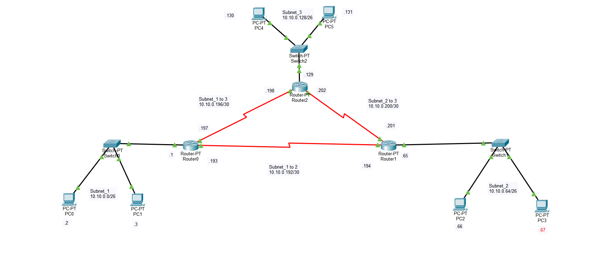

# 📡 CCNA Subnetting Project (VLSM)

## 🧠 Overview

This project demonstrates subnetting using **VLSM (Variable Length Subnet Mask)** based on the network `10.10.0.0/18`.

The objective is to design efficient subnets according to host requirements and implement the network in **Cisco Packet Tracer**, ensuring full connectivity between all devices.

---

## 📌 Problem Statement

A company network is given:

**Network:** `10.10.0.0/18`

### Requirements:

* Subnet_1 → up to 56 hosts
* Subnet_2 → up to 32 hosts
* Subnet_3 → up to 50 hosts
* Point-to-point links → 2 hosts each

---

## 🗺️ Network Topology

  

---

## ⚙️ Subnetting Design (VLSM)

### 🧩 Main Subnets

| Subnet   | Needed Hosts | Allocated | Network Address | Subnet Mask     | Usable Range              | Broadcast   |
| -------- | ------------ | --------- | --------------- | --------------- | ------------------------- | ----------- |
| Subnet_1 | 56           | 62        | 10.10.0.0/26    | 255.255.255.192 | 10.10.0.1 - 10.10.0.62    | 10.10.0.63  |
| Subnet_2 | 32           | 62        | 10.10.0.64/26   | 255.255.255.192 | 10.10.0.65 - 10.10.0.126  | 10.10.0.127 |
| Subnet_3 | 50           | 62        | 10.10.0.128/26  | 255.255.255.192 | 10.10.0.129 - 10.10.0.190 | 10.10.0.191 |

---

### 🔗 Point-to-Point Links

| Link                | Network        | Subnet Mask     | Usable IPs                | Broadcast   |
| ------------------- | -------------- | --------------- | ------------------------- | ----------- |
| Subnet_1 ↔ Subnet_2 | 10.10.0.192/30 | 255.255.255.252 | 10.10.0.193 - 10.10.0.194 | 10.10.0.195 |
| Subnet_1 ↔ Subnet_3 | 10.10.0.196/30 | 255.255.255.252 | 10.10.0.197 - 10.10.0.198 | 10.10.0.199 |
| Subnet_2 ↔ Subnet_3 | 10.10.0.200/30 | 255.255.255.252 | 10.10.0.201 - 10.10.0.202 | 10.10.0.203 |

---

## 🛠️ Tools & Technologies

* Cisco Packet Tracer
* IP Subnetting (VLSM)
* Networking Fundamentals (CCNA)

---

## ✅ Features

* Efficient subnet allocation using VLSM
* Accurate IP addressing and masking
* Point-to-point network configuration
* Full connectivity verification using ping tests
* Real-world network design scenario

---

## 📂 Project Files

* `project.pdf` → Detailed subnetting solution and calculations
* `CISCO.png` → Network topology diagram
* `topology.pkt` → Cisco Packet Tracer implementation

---

## 🚀 How to Run

1. Open the `.pkt` file using **Cisco Packet Tracer**
2. Verify IP configuration on all devices
3. Use the **ping command** to test connectivity between PCs
4. Ensure all networks can communicate successfully

---

## 🎯 Learning Outcomes

* Understanding of VLSM subnetting
* IP address planning and optimization
* Network topology design
* Practical Packet Tracer simulation

---

## 👨‍💻 Author

**Pritom Bhowmik**
CCNA Student (Batch 13)

---

## 📜 License

This project is for educational purposes only.
